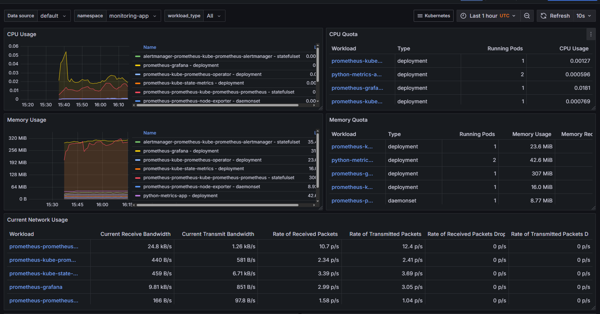

# Python Microservice with Kubernetes, Prometheus, and Grafana

## Overview
This repository contains a simple Python Flask microservice that is containerized using Docker. The project demonstrates a complete DevOps pipeline by deploying this microservice to a local Kubernetes cluster (k3d), setting up comprehensive monitoring with Prometheus and Grafana, and automating the entire process with a Python deployment script.

## Prerequisites
Before running the deployment script, ensure you have the following tools installed and accessible in your system's PATH:

*   **Docker Desktop** (or Docker Engine): For building and managing Docker images.
*   **k3d**: A lightweight wrapper to run k3s (Rancher Lab's minimal Kubernetes distribution) in Docker, enabling local Kubernetes clusters.
*   **kubectl**: The Kubernetes command-line tool for interacting with your Kubernetes cluster.
*   **Helm**: The package manager for Kubernetes, used here to deploy the Prometheus-Grafana stack.
*   **Python 3.10+**: The scripting language for the microservice and the deployment automation.

Once Python is installed, install the project's Python dependencies:

```bash
pip install -r requirements.txt
```

## Setup and Deployment

To deploy the entire stack (k3d cluster, Docker image, Kubernetes application, Prometheus, and Grafana), run the following command from the project root:

```bash
python deploy.py deploy
```

The script will provide status updates throughout the deployment process. Upon successful completion, it will print the URL for accessing the Grafana UI.

### Accessing the Application
The Python microservice is configured to run on port `5000`. To access it locally and generate traffic for metrics:

1.  The `deploy.py` script will automatically expose the application via a Kubernetes `Service`.
2.  You can access the application by port-forwarding its service:
    ```bash
    kubectl port-forward svc/python-metrics-app 5000:5000 -n monitoring-app
    ```
3.  Then, open your browser to [http://localhost:5000/](http://localhost:5000/). Refreshing this page or visiting paths like `http://localhost:5000/foo` will generate metrics.

### Accessing Prometheus
Prometheus UI can be accessed via port-forward:

```bash
kubectl port-forward svc/prometheus-kube-prometheus-prometheus 9090:9090 -n monitoring-app
```
Then navigate to [http://localhost:9090](http://localhost:9090) in your browser.

### Accessing Grafana
After successful deployment, the `deploy.py` script will output the specific NodePort for Grafana. You can then access it directly via `http://localhost:<NODE_PORT>`.

The default Grafana login credentials are:
*   **Username**: `admin`
*   **Password**: `prom-operator`

## Cleanup
To tear down the entire environment, including the k3d cluster and all deployed resources, run:

```bash
python deploy.py cleanup
```

## Grafana Dashboard
This repository includes a JSON file (`grafana_dashboard.json`) with a pre-built Grafana dashboard. You can import this dashboard into your Grafana instance by navigating to the Dashboards section, clicking 'Import', and uploading the JSON file. This will provide a quick start to visualizing your application's metrics. 

 